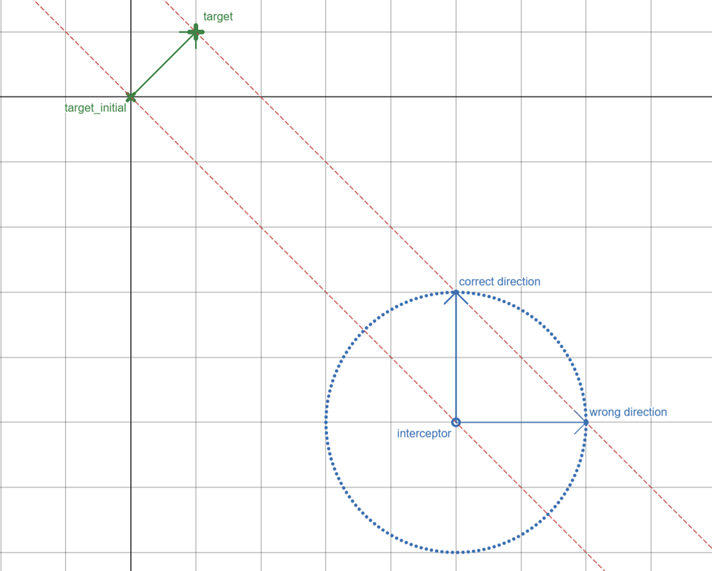
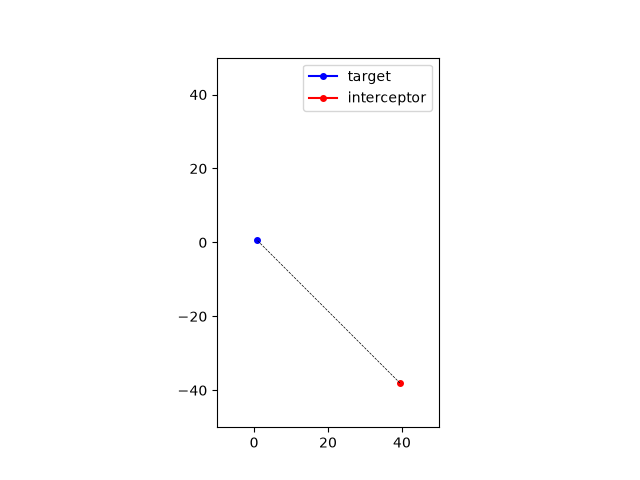
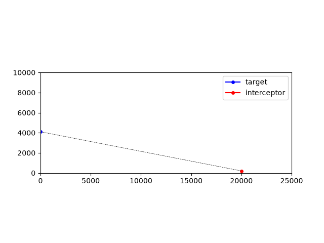
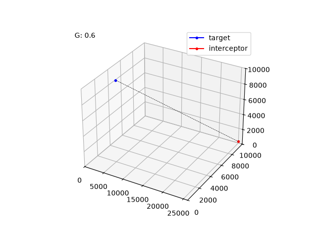

# Navigation and Guidance

Have you ever wondered how a launched missile guides itself to its target?

In this short tutorial, I would like to explain the basics behind navigation and guidance algorithms.

The basic theory of navigation and guidance can be summarized as follows:

- An interceptor must try to keep the LOS (line of sight) angle to the target constant.
- An interceptor must have sufficient kinetic energy to reach the target.

I'll walk through three small Python simulations, in increasing order of realism: **CBDR** (the geometric intuition), **Proportional Navigation in 2D** (true proportional navigation in a plane), and **Proportional Navigation in 3D** (the same law generalized to 3D with vectors)

## 1. CBDR — Constant Bearing, Decreasing Range

Sailors know CBDR as a warning sign: if another vessel's bearing from your own ship stays constant while the range closes, you are on a collision course.

`CBDR.py` turns that warning into a guidance rule — instead of avoiding the constant bearing, the interceptor deliberately holds it.

We know the equation of a straight line:

$$y = mx + d$$

At first, the interceptor tries to determine the straight line passing through the target and itself. It does it by determining the two parameters of a straight line: the slope $m$ and the y-axis intercept $d$:

$$m = \frac{y_{t} - y_{i}}{x_{t} - x_{i}} \qquad d = y_{t} - m x_{t}$$

```python
m = (target_coordinates_xy[1] - interceptor_coordinates_xy[1]) / (target_coordinates_xy[0] - interceptor_coordinates_xy[0])
d_0 = target_coordinates_xy[1] - m * target_coordinates_xy[0]
```

That slope $m$ is the bearing that the interceptor wants to **keep constant**. Each step, the target moves and the line is translated (same slope, new y-intercept) to pass through the target's new position:

$$d_{new} = y + v_ydt - m(x+v_xdt) = y - mx + v_ydt - mv_xdt = d_{old} + v_ydt - mv_xdt$$

```python
d_1 = d_0 + target_velocity_xy[1]*dt - m*target_velocity_xy[0]*dt
```

Then the interceptor asks: where on that line can it land, given it can only travel a distance of $|v_i|dt$ this step? That's a line–circle intersection — a quadratic equation:

$$\begin{cases}
  (y-y_i)^2+(x-x_i)^2=(|v_i|dt)^2 \\
  y=mx+d_{new}
\end{cases}$$

$$(mx+d_{new}-y_i)^2+(x-x_i)^2-(|v_i|dt)^2=(m^2+1)x^2+(2md_{new}-2my_i - 2x_i)x+(d_{new}-y_i)^2+x_i^2-(|v_i|dt)^2=0$$

$$ax^2+bx+c=0$$

```python
a = m*m + 1
b = 2*m*d_1 - 2*m*interceptor_coordinates_xy[1] - 2*interceptor_coordinates_xy[0]
c = (d_1 - interceptor_coordinates_xy[1])**2 + interceptor_coordinates_xy[0]**2 - (interceptor_velocity_magnitude*dt)**2
```

Solving the quadratic, two roots ($x_1$ and $x_2$) come out. The interceptor then solves for the corresponding $y_1$ and $y_2$ (using the equation of the line), resulting in two possible points $(x_1, y_1)$ and $(x_2, y_2)$. The interceptor jumps to whichever solution lands closer to the target, discarding the one that would send the it the "wrong way" down the line.





**Why this works and why it's just a teaching tool rather than a real guidance law:** By construction, the interceptor is forced onto the constant-bearing line every single step. There's no sensor, no rate estimate, no control loop - pure geometry. It's a clean way to demonstrate the core idea (constant LOS angle results in collision) before introducing a law that a real seeker could actually implement using only what it can measure: range rate and LOS angle rate.

## 2. True Proportional Navigation

Real interceptors can't solve a line-circle intersection against a target's future position, they only know their own LOS angle to the target and how fast it's changing. **True Proportional Navigation** turns that limited information into a steering command:

$$a_n = N \cdot V_c \cdot \dot\lambda$$

Where:

- $\lambda$ — the LOS angle, the bearing from interceptor to target
- $\dot\lambda$ — how fast that bearing is rotating (this is what we're trying to drive to zero)
- $V_c$ — closing velocity, how fast the range is shrinking
- $N$ — the navigation constant (a gain)
- $a_n$ — commanded acceleration, applied **perpendicular** to the interceptor's velocity

The intuition is that if the LOS is changing, you're not on a collision course, so turn harder in proportion to both how fast the bearing is rotating and how fast you're closing.

In `ProNav2D.py`, each of these is computed directly from position history, so nothing about the target's future path is assumed:

```python
lambda_los = math.atan2(target_coordinates_xy[1] - interceptor_coordinates_xy[1], target_coordinates_xy[0] - interceptor_coordinates_xy[0])

V_c = -(distance - prev_distance) / dt

angle_diff = (lambda_los - prev_lambda_los + math.pi) % (2 * math.pi) - math.pi

lambda_dot = angle_diff / dt

prev_lambda_los = lambda_los

prev_distance = distance

a_n = N * V_c * lambda_dot
```

(The `% (2*math.pi) - math.pi` wrap keeps the angle difference in $(-\pi, \pi]$ so a bearing crossing from $+179°$ to $-179°$ doesn't get misread as a huge rotation.)

That scalar $a_n$ still needs a direction. Since PN acceleration is always normal to the velocity vector, the current heading $\theta_v$ is calculated and rotated by 90° to get that normal direction $\theta_{a_n}$ to apply the acceleration $a_n$. Then the velocity vector rescaled back to the interceptor's fixed speed (real interceptors don't speed up under a lateral turn, actually quite the opposite):

$$\theta_{a_n} = \theta_v + \frac{\pi}{2} \qquad \theta_v = \textrm{atan2}(v_x, v_y)$$

```python
theta_V = math.atan2(interceptor_velocity_xy[1], interceptor_velocity_xy[0])
theta_a_n = theta_V + math.pi / 2

interceptor_velocity_xy[0] += a_n * math.cos(theta_a_n)
interceptor_velocity_xy[1] += a_n * math.sin(theta_a_n)
```

The target itself isn't flying straight either. This also demonstrates PN's robustness against a maneuvering target, which is exactly where CBDR's rigid geometric solution would fall apart.



## 3. The 3D form

Missiles don't fly in a plane, so the last step is generalizing the scalar PN law to full 3D. The trick is that $\dot\lambda$ (a scalar rotation rate in 2D) becomes an **angular velocity vector** $\vec\omega$ in 3D, the rate at which the line-of-sight vector is rotating about some axis, computed the same way you would compute angular velocity for any rotating body:

$$\vec V_r = \vec\omega \times \vec R $$
$$\vec R \times \vec V_r = \vec R \times (\vec \omega \times \vec R)= \vec \omega (\vec R \cdot \vec R) - (\vec R \cdot \vec \omega) \vec R$$

since $\vec R \perp \vec \omega$, the term $\vec R \cdot \vec \omega$ is zero. Therefore:

$$\vec\omega = \frac{\vec R \times \vec V_r}{\vec R \cdot \vec R}$$

where $\vec R$ is the relative position (target minus interceptor) and $\vec V_r$ is the target-interceptor closing velocity. The same "rate of bearing change" idea as $\dot\lambda$, just no longer confined to a single plane.

The commanded acceleration follows the same cross-product pattern, replacing the scalar multiplication $V_c \cdot \dot\lambda$ with a vector cross product $\vec V_r \times \vec\omega$:

$$\vec a_n = N \vec V_r \times \vec\omega$$

```python
omega_xyz_times_RdotR = cross3D(R_xyz, Vr_xyz)
RdotR = dot3D(R_xyz, R_xyz)
omega_xyz[0] = omega_xyz_times_RdotR[0] / RdotR
omega_xyz[1] = omega_xyz_times_RdotR[1] / RdotR
omega_xyz[2] = omega_xyz_times_RdotR[2] / RdotR

a_xyz_divide_N = cross3D(Vr_xyz, omega_xyz)
a_xyz = [a_xyz_divide_N[0] * N, a_xyz_divide_N[1] * N, a_xyz_divide_N[2] * N]
```

This single vector `a_xyz` automatically comes out perpendicular to the relative velocity, so just like in 2D, it only needs to be added to the interceptor's velocity and then rescaled back to constant speed:

```python
interceptor_velocity_xyz[0] += a_xyz[0] * dt
interceptor_velocity_xyz[1] += a_xyz[1] * dt
interceptor_velocity_xyz[2] += a_xyz[2] * dt
```

No separate "which way is normal" trigonometry is needed here, because the cross product handles direction and magnitude together. That's the real payoff of moving to vector notation. The target in this version also maneuvers in 3D, weaving its heading in the y–z plane while flying forward in x, and you can watch the interceptor's LOS line (the dashed line in the animation) staying roughly fixed in direction as the range collapses. The same CBDR condition from part 1, now emerging as a consequence of the PN law rather than being imposed directly.



## Takeaways

- **CBDR** shows **why** constant bearing implies collision — a geometric proof, not a controllable guidance law.
- **ProNav2D** shows **how** a real seeker, using only LOS angle and range measurements, can enforce that same condition through feedback.
- **ProNav3D** shows that the 2D law isn't a special case — it's a vector identity that extends cleanly once you replace scalar bearing rate with an angular velocity vector.
Same principle throughout: **null the LOS rotation rate, and you're on a collision course.**
